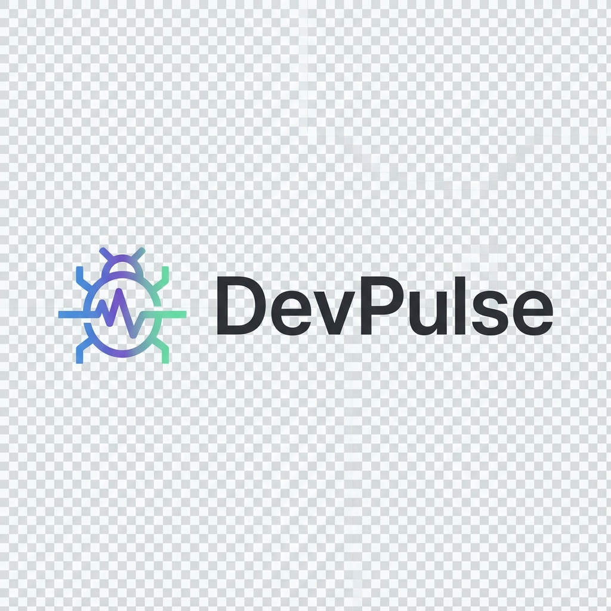

# DevPulse

> **Developer Productivity & Issue Intelligence Desktop App**

A powerful Electron-based desktop application for tracking developer productivity, managing issues, and analyzing project health across your entire organization.



---

## 🎯 Features

### Hierarchical Organization
- **Product → Client → Project** structure for white-label flexibility
- Organize work by product lines, client accounts, and individual projects
- Perfect for agencies, consultancies, and multi-product companies

### Developer Productivity Tracking
- Track individual and team productivity scores
- Skills-based developer profiles
- Seniority level management
- Workload distribution insights

### Issue Intelligence
- Bug tracking with severity levels
- Recurrence detection for chronic issues
- Time-to-fix analytics
- Fix quality ratings
- Feature stability monitoring

### Advanced Analytics
- Dashboard with key metrics
- Productivity rankings
- Issue trend analysis
- Project health comparison
- Interactive charts and visualizations

### Modern UI
- Clean, professional macOS-native design
- Dark/Light theme support
- Responsive layouts
- Real-time updates

---

## 🚀 Quick Start

### Prerequisites
- Node.js 18+ 
- npm or yarn

### Installation

```bash
# Clone the repository
git clone <repository-url>
cd DevPulse

# Install dependencies
npm install

# Set up database
npx prisma generate
npx prisma migrate dev

# Start development server
npm run electron:dev
```

The app will launch automatically with a clean, empty database ready for your data.

---

## 📦 Tech Stack

- **Frontend**: React 18, TypeScript, React Router
- **Desktop**: Electron 28
- **Database**: SQLite with Prisma ORM
- **Charts**: Recharts
- **Build**: Vite
- **Styling**: CSS with design tokens

---

## 🏗️ Project Structure

```
DevPulse/
├── electron/           # Electron main & preload
│   ├── main.ts        # Main process
│   ├── preload.ts     # Preload script
│   └── ipc/           # IPC handlers
├── src/               # React application
│   ├── components/    # Reusable components
│   ├── pages/         # Page components
│   └── types/         # TypeScript types
├── prisma/            # Database schema & migrations
├── public/            # Static assets (logos, icons)
└── styles/            # Global CSS
```

---

## 🎨 White-Label Setup

DevPulse is **fully white-label ready**:

### 1. Branding
- Replace logos in `public/assets/icons/` and `public/assets/logos/`
- Update app name in `package.json`
- Customize colors in `styles/global.css`

### 2. Data Organization
Create your hierarchy:
1. **Products** → Your product lines or service categories
2. **Clients** → Customer accounts under each product
3. **Projects** → Individual projects per client
4. **Developers** → Your team members
5. **Issues** → Track and analyze bugs

### 3. Clean Database
The database starts **completely empty** with no sample data. Build your organization from scratch!

---

## 📱 Pages

- **Dashboard** - Overview metrics and charts
- **Products** - Manage product lines
- **Clients** - Manage client accounts  
- **Projects** - Create and track projects
- **Issues** - Bug tracking and analysis
- **Developers** - Team management
- **Analytics** - Deep dive into productivity & quality
- **Settings** - App configuration

---

## 🛠️ Development

```bash
# Run in development mode
npm run electron:dev

# Build for production
npm run build

# Build macOS app
npm run build:mac

# Database commands
npm run db:migrate    # Run migrations
npm run db:generate   # Generate Prisma client
npm run db:seed       # Seed database (clears all data)
npm run db:studio     # Open Prisma Studio
```

---

## 📊 Database Schema

### Core Models

**Product** → **Client** → **Project** → **Issues**

- **Product**: Top-level organization (product lines, service categories)
- **Client**: Customer accounts within products
- **Project**: Individual projects with type, dates, status
- **Developer**: Team members with skills and seniority
- **Issue**: Bugs with severity, status, recurrence tracking
- **Feature**: Project features for stability analysis

---

## 🎯 Use Cases

### Software Agency
```
📦 Web Development
   👤 Acme Corp → 🗂️ Website Redesign
   👤 TechStart → 🗂️ E-commerce Platform

📦 Mobile Apps  
   👤 FinTech Co → 🗂️ iOS Banking App
```

### Product Company
```
📦 VU Gear (Video Conferencing)
   👤 Enterprise A → 🗂️ Custom Integration
   
📦 IP Gear (Networking)
   👤 Enterprise B → 🗂️ Network Deployment
```

### Internal IT
```
📦 Infrastructure
   👤 HR Department → 🗂️ Portal Upgrade
   
📦 Applications
   👤 Sales Team → 🗂️ CRM Migration
```

---

## 🔐 Security

- SQLite database stored locally (file-based)
- No external API calls
- All data stays on your machine
- Context isolation enabled in Electron

---

## 📄 License

MIT

---

## 🤝 Contributing

This is a private project. For questions or issues, contact the development team.

---

## 📞 Support

For setup assistance or customization requests, refer to:
- `QUICKSTART.md` - Step-by-step setup guide
- `WHITELABEL_GUIDE.md` - White-label customization guide
- `HIERARCHY_CHANGES.md` - Technical implementation details

---

**Built with ❤️ for developer productivity**
