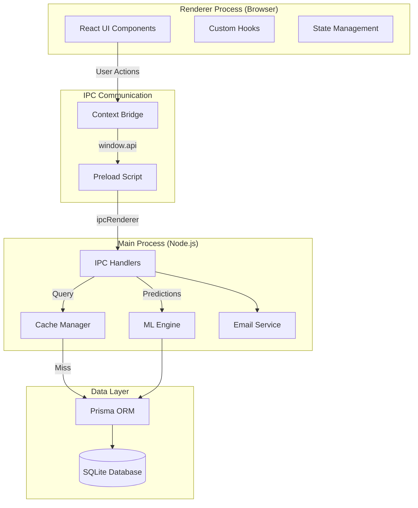
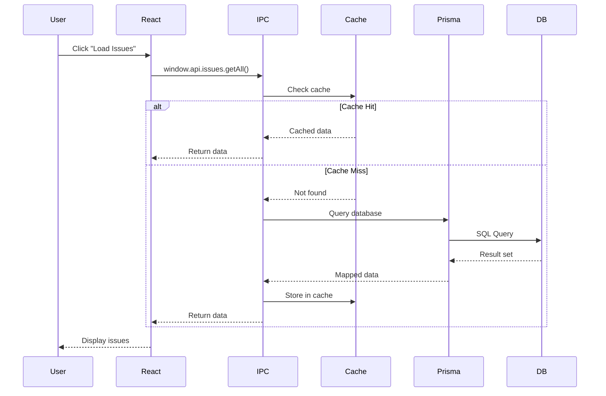
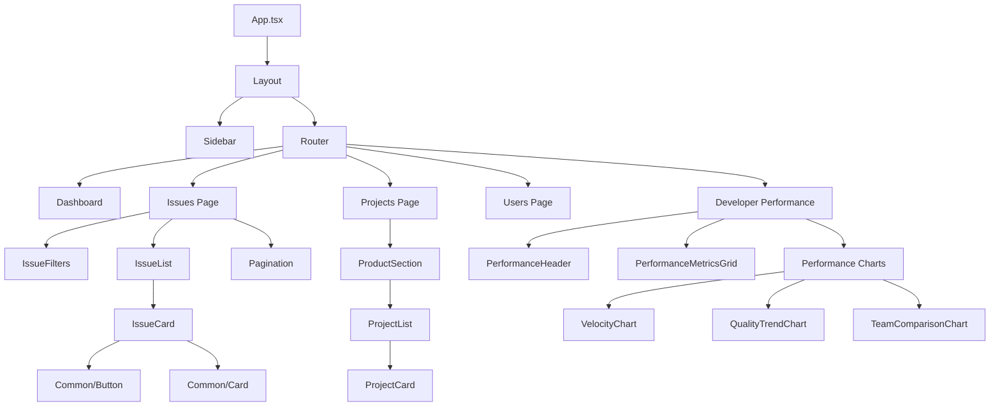
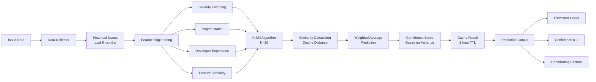
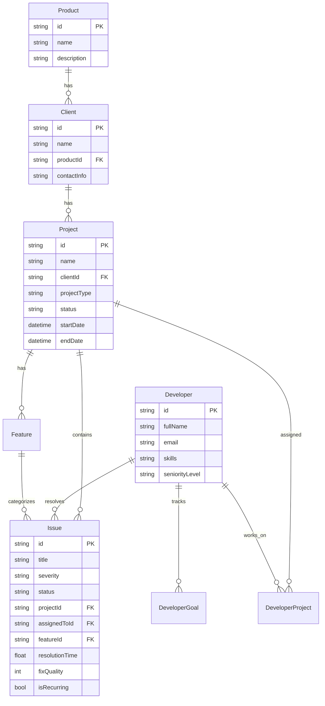
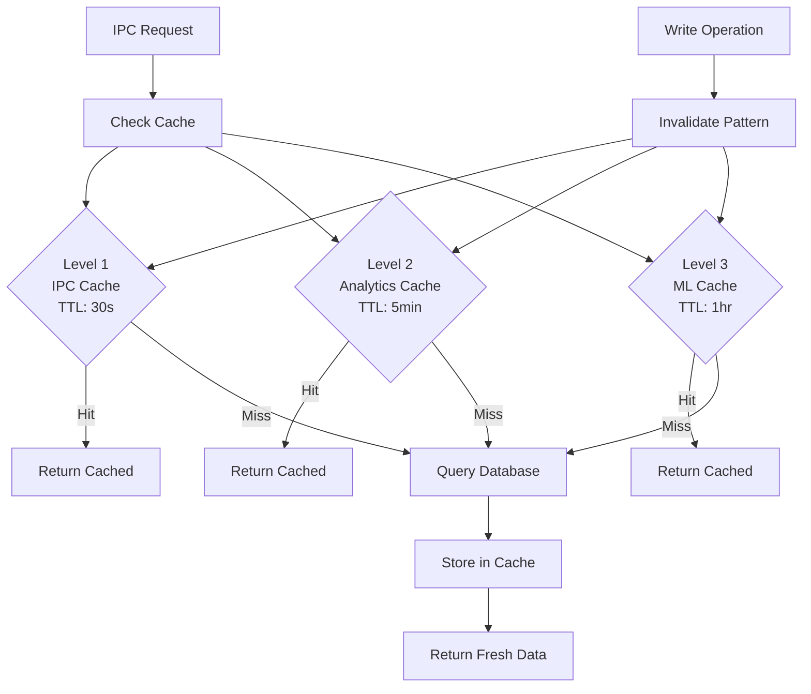
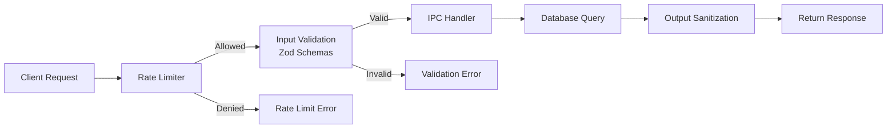
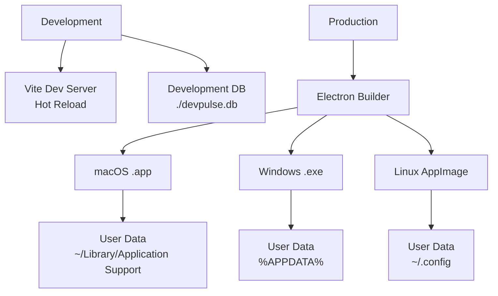
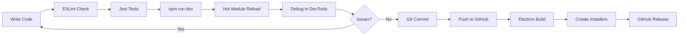

# DevPulse Architecture Documentation

System architecture and design documentation for DevPulse.

---

## System Overview

DevPulse is an Electron-based desktop application for project management and developer performance tracking, built with:

- **Frontend**: React + TypeScript + Vite
- **Backend**: Electron Main Process + Node.js
- **Database**: SQLite + Prisma ORM
- **ML/AI**: Custom prediction and matching algorithms

---

## High-Level Architecture

---

## Data Flow Diagram

---

## Component Hierarchy

---

## ML Pipeline

---

## Database Schema

---

## Cache Architecture

---

## Security Architecture

---

## Deployment Architecture

---

## Performance Optimizations

### Database
- **Indexes**: 9 strategic indexes on frequently queried fields
- **Query Optimization**: Batch queries, select only needed fields
- **Connection Pooling**: Single Prisma instance reused

### Caching
- **LRU Cache**: Automatically evicts least recently used
- **Multi-tier**: Different TTLs for different data types
- **Pattern Invalidation**: Smart cache clearing on mutations

### Frontend
- **Code Splitting**: Lazy loading for routes
- **Component Memoization**: React.memo for expensive renders
- **Virtual Scrolling**: For large lists (1000+ items)

---

## Technology Stack

| Layer | Technology |
|-------|------------|
| **Desktop Framework** | Electron 28 |
| **Frontend Framework** | React 18 + TypeScript |
| **Build Tool** | Vite 5 |
| **Routing** | React Router 6 |
| **Database** | SQLite 3 |
| **ORM** | Prisma 5 |
| **State Management** | React Hooks (useState, useContext) |
| **Charts** | Recharts |
| **Styling** | Vanilla CSS |
| **Testing** | Jest + React Testing Library |
| **Validation** | Zod |
| **ML/AI** | simple-statistics (K-NN) |

---

## Development Workflow

---

## Best Practices

### Code Organization
- **Feature-based structure**: Group by feature, not file type
- **Single Responsibility**: Each module has one clear purpose
- **DRY Principle**: Reusable components and utilities

### Performance
- **Lazy loading**: Load resources only when needed
- **Debouncing**: Throttle expensive operations
- **Pagination**: Always paginate large datasets

### Security
- **Input validation**: All user input validated with Zod
- **Rate limiting**: Prevent API abuse
- **SQL injection prevention**: Prisma parameterized queries

### Testing
- **Unit tests**: For pure functions and utilities
- **Integration tests**: For IPC handlers
- **Component tests**: For React components

---

**Last Updated:** 2024-12-11
